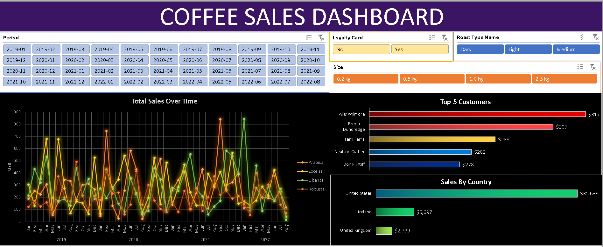

# CoffeeDashboard



Coffee Sales Dashboard (Excel Project)

## Introduction
Today, we are analyzing coffee order data to find trends in sales over time and by different coffee bean types, sales by country, and insights into who our top customers are.

The dashboard itself will be interactive, allowing filtering by time period, type of coffee roast, coffee sizes, and whether or not the customers are loyalty members.

My aim in this project is to explain, step-by-step, my methodology and thought process. This project will not just focus on the end product but also on the steps taken to get there.

## Data Analysis Process
### Orders Table
On our Orders worksheet, columns A-E are populated, while columns F-M are blank. These will be populated using lookups, which are documented below.

### Customers Table
The Customers table includes customer details such as name, email, phone number, address, and loyalty member status. Each row is identified by a unique customer ID (primary key).

### Products Table
Similar to the Customers table, the Products table has a Product ID as its primary key. It contains information on coffee type, roast type, size, unit price, price per 100g, and profit.

## Step 1: Gathering Data
First, we transfer information from the Customers and Products tables to the Orders table using XLOOKUP and INDEX/MATCH.

### XLOOKUP
To populate the Customer Name column:
```
=XLOOKUP(C2,customers!$A$1:$A$1001,customers!$B$1:$B$1001,,0)
```
This function looks up the Customer ID in the Customers table and returns the matching customer name.

Similarly, to retrieve the Email and Country columns:
```
=XLOOKUP(C2,customers!$A$1:$A$1001,customers!$C$1:$C$1001,,0)
```
To remove ‘0’ values from missing data:
```
=IF(XLOOKUP(C2,customers!$A$1:$A$1001,customers!$C$1:$C$1001,,0) = 0, "",XLOOKUP(C2,customers!$A$1:$A$1001,customers!$C$1:$C$1001,,0))
```

### INDEX/MATCH
For the remaining table data:
```
=INDEX(products!$A$1:$G$49,MATCH(orders!$D2,products!$A$1:$A$49,0),MATCH(orders!I$1,products!$A$1:$G$1,0))
```
This fills the Coffee Type, Roast Type, Size, and Unit Price columns.

### Additional Formatting
To calculate sales:
```
=$L2*$E2
```
For Coffee Type and Roast Type:
```
=IF(I2="Rob", "Robusta",IF(I2="Exc","Excelsa",IF(I2="Ara","Arabica", IF(I2= "Lib", "Liberica",""))))
```
```
=IF(J2="L", "Light", IF(J2= "M", "Medium", IF(J2= "D", "Dark", "")))
```
To retrieve the Country column:
```
=XLOOKUP(C2,customers!$A$1:$A$1001,customers!$G$1:$G$1001,,0)
```
Finally, we convert the data into a table for easier manipulation in Pivot Tables.

## Step 2: Pivot Tables
### Total Sales Over Time
Using a pivot table, we calculate total sales for each year and month (2019-2022) and create a chart to visualize trends.

### Slicers
To enhance user customization, slicers are added for:
- Roast Type
- Size
- Loyalty Member Status

These help stakeholders determine popular roasts, profitable sizes, and the impact of the Loyalty Member program.

### Sales By Country
A bar chart is created by adjusting pivot table parameters to show sales by country, sorted in descending order.

### Top 5 Customers
By modifying the pivot table to display Customer Name instead of Country and applying a Top 5 filter, we generate a clean visualization of our highest-value customers.

## Step 3: Building a Dashboard
A new worksheet is used to compile all pivot charts with formatting and slicer adjustments. By linking slicers to all charts, filtering updates every visualization simultaneously.

After final adjustments and removing gridlines, the interactive dashboard is complete!
